# Stage 2 Report

## Non Parameterized Queries

### SELECT Queries

1. **Query 1**: Retrieve the passenger names, flight numbers, and departure/arrival times for all flights departing from 'JFK Airport New York' on a specific date. for example if we need to be sure that some passenger did or didn't catch his flight (for the insurance)

```sql
SELECT p.PASSENGER_NAME, f.FLIGHT_NUMBER, f.DEPARTURE_TIME, f.ARRIVAL_TIME
FROM Passengers p
JOIN Bookings b ON p.PASSENGER_ID = b.PASSENGER_ID
JOIN Flights f ON b.FLIGHT_ID = f.FLIGHT_ID
WHERE f.DEPARTURE_AIRPORT = (SELECT AIRPORT_ID FROM Airports WHERE LOCATION = 'JFK')
AND f.DEPARTURE_TIME >= TO_DATE('2024-05-15') AND f.DEPARTURE_TIME < TO_DATE('2024-05-16');
```

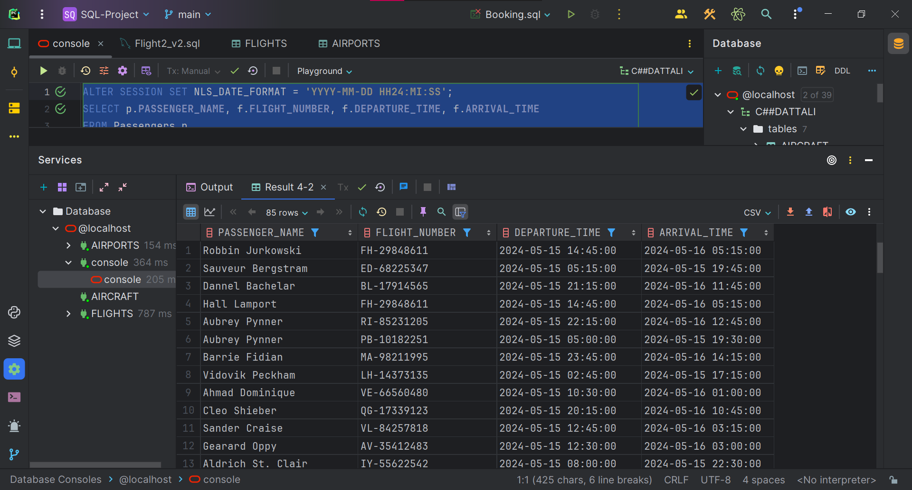

2. **Query 2**: Find the flight details (flight number, departure/arrival airports, aircraft type, and airline name) for flights with a specific aircraft type. for example if there was a class action lawsuit exainst boeing we could find all the passengers that could be elegeble for componsestion

```sql
SELECT f.FLIGHT_NUMBER, dep.AIRPORT_NAME AS DEPARTURE_AIRPORT, arr.AIRPORT_NAME AS ARRIVAL_AIRPORT, a.AIRCRAFT_TYPE, al.AIRLINE_NAME
FROM Flights f
JOIN Airports dep ON f.DEPARTURE_AIRPORT = dep.AIRPORT_ID
JOIN Airports arr ON f.ARRIVAL_AIRPORT = arr.AIRPORT_ID
JOIN Aircraft a ON f.AIRCRAFT_ID = a.AIRCRAFT_ID
JOIN Airlines al ON f.AIRLINE_ID = al.AIRLINE_ID
WHERE a.AIRCRAFT_TYPE = 'Boeing 737';
```

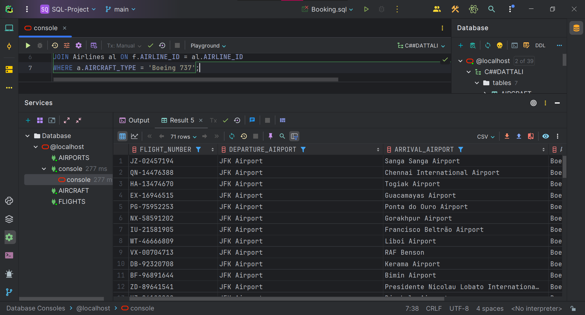

3. **Query 3**: Get the total number of bookings and the average passenger age for each flight, ordered by the flight number. for admin & marketing reasons

```sql
SELECT f.FLIGHT_NUMBER, 
       COUNT(b.BOOKING_ID) AS TOTAL_BOOKINGS, 
       AVG(EXTRACT(YEAR FROM SYSDATE) - EXTRACT(YEAR FROM p.PASSENGER_BIRTHDATE)) AS AVG_PASSENGER_AGE
FROM Flights f
LEFT JOIN Booking b ON f.FLIGHT_ID = b.FLIGHT_ID
LEFT JOIN Passengers p ON b.PASSENGER_ID = p.PASSENGER_ID
GROUP BY f.FLIGHT_NUMBER
ORDER BY f.FLIGHT_NUMBER

```

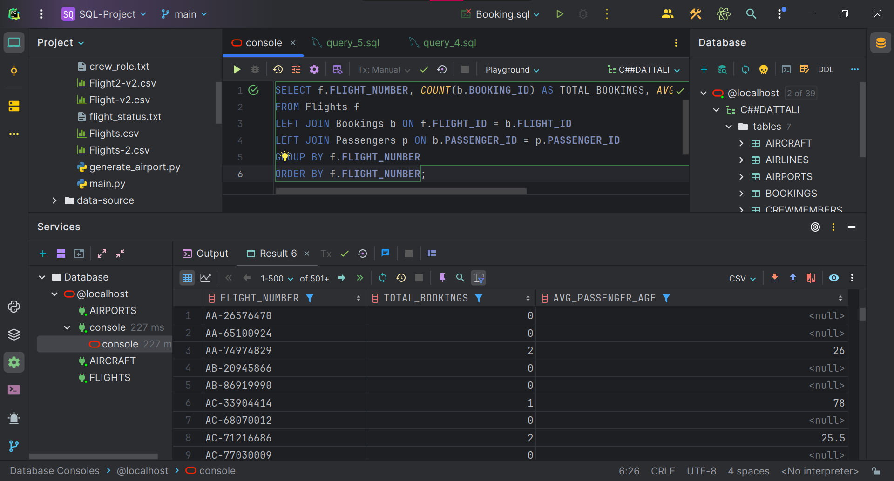

4. **Query 4**: Retrieve the crew members' names and roles for flights with a specific departure airport and arrival airport on a given date range.

```sql
SELECT cm.CREW_NAME, cm.CREW_ROLE
FROM CrewMembers cm
JOIN WorkingCrew wc ON cm.CREW_ID = wc.CREW_ID
JOIN Flights f ON wc.FLIGHT_ID = f.FLIGHT_ID
WHERE f.DEPARTURE_AIRPORT = (SELECT AIRPORT_ID FROM Airports WHERE AIRPORT_NAME = 'JFK Airport New York')
 AND f.ARRIVAL_AIRPORT = (SELECT AIRPORT_ID FROM Airports WHERE AIRPORT_NAME = 'LAX Airport Los Angeles')
 AND f.DEPARTURE_TIME >= TO_DATE('2023-06-01', 'YYYY-MM-DD')
 AND f.DEPARTURE_TIME < TO_DATE('2023-06-15', 'YYYY-MM-DD'

```


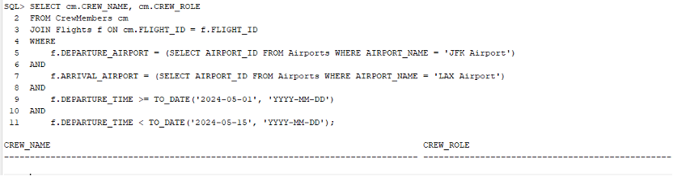

5. An airline manager wants to check the monthly and annual number of flights in order to analyze seasonal and annual trends

```sql
SELECT 
    EXTRACT(YEAR FROM f.Departure_Time) AS Year,
    EXTRACT(MONTH FROM f.Departure_Time) AS Month,
    COUNT(f.Flight_ID) AS Number_of_Flights
FROM 
    Flights f
GROUP BY 
    EXTRACT(YEAR FROM f.Departure_Time), EXTRACT(MONTH FROM f.Departure_Time)
ORDER BY 
    Year DESC, Month DESC;
```

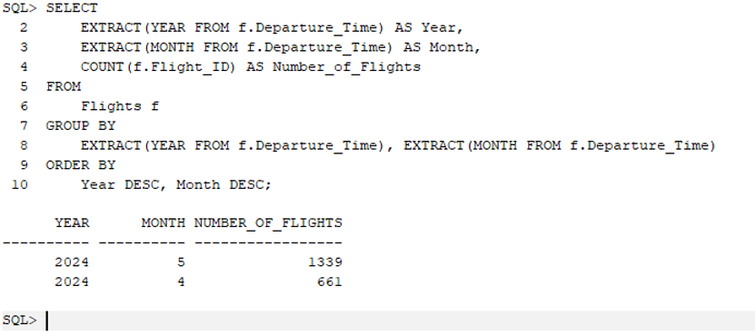

6. An airline manager would like to know which of the flights is exceeding the average flight time and by how long

```sql
SELECT 
    f.Flight_Number,
    air.Airline_Name,
    p.Passenger_Name,
    (f.Arrival_Time - f.Departure_Time) AS Flight_Duration_Days,
    avg_flight_duration.Avg_Flight_Duration_Days
FROM 
    Flights f
JOIN 
    Airlines air ON f.Airline_ID = air.Airline_ID
JOIN 
    Bookings b ON f.Flight_ID = b.Flight_ID
JOIN 
    Passengers p ON b.Passenger_ID = p.Passenger_ID
JOIN (
    SELECT 
        f2.Airline_ID,
        AVG(f2.Arrival_Time - f2.Departure_Time) AS Avg_Flight_Duration_Days
    FROM 
        Flights f2
    WHERE 
        f2.Flight_Status = 'Arrived'
    GROUP BY 
        f2.Airline_ID
) avg_flight_duration ON f.Airline_ID = avg_flight_duration.Airline_ID
WHERE 
    f.Flight_Status = 'Arrived'
AND 
    (f.Arrival_Time - f.Departure_Time) > avg_flight_duration.Avg_Flight_Duration_Days
ORDER BY 
        f.Flight_Number;
```

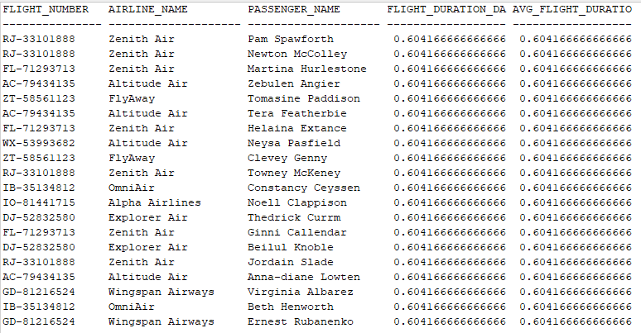

### DELETE Queries

1. **Query 1**: Delete all bookings for a specific passenger, for example "John Doe" is a 'persona no grata' and we want to remove all his bookings, form this day (16.05.2024) forward (for the insurance)

```sql
DELETE FROM Bookings
WHERE PASSENGER_ID = (SELECT PASSENGER_ID FROM Passengers WHERE PASSENGER_NAME = 'John Doe')
 AND BOOKINGS.BOOKING_DATE >= TO_DATE('2024-05-16');
```

2. **Query 2**: Remove flights with a specific flight status and departure/arrival airport combination.

```sql
DELETE FROM Flights
WHERE FLIGHT_STATUS = 'Cancelled'
 AND DEPARTURE_AIRPORT = (SELECT AIRPORT_ID FROM Airports WHERE LOCATION = 'JFK')
 AND ARRIVAL_AIRPORT = (SELECT AIRPORT_ID FROM Airports WHERE LOCATION = 'LAX');
```

3. **Query 3**: Delete all the passenger from the booking who are older than 90 years old since the WHO has declared that they are not allowed to travel anymore, from this day (16.05.2024) forward.

```sql
DELETE FROM Bookings
WHERE PASSENGER_ID IN (SELECT PASSENGER_ID FROM Passengers WHERE EXTRACT(YEAR FROM SYSDATE) - EXTRACT(YEAR FROM PASSENGER_BIRTHDATE) > 90)
AND BOOKING_DATE >= TO_DATE('2024-05-16', 'YYYY-MM-DD');

```
4. In order to keep the database clean, once a day all tickets purchased for canceled flights are deleted from the system

```sql
DELETE FROM Bookings
WHERE Flight_ID IN (
    SELECT Flight_ID
    FROM Flights
    WHERE Flight_Status = 'Cancelled'
);
```

### UPDATE Queries


1. **Query 1**: Update the flight status for all flights departing from a specific airport on a given date.

```sql
UPDATE Flights
SET FLIGHT_STATUS = 'Delayed'
WHERE DEPARTURE_AIRPORT = (SELECT AIRPORT_ID FROM Airports WHERE AIRPORT_NAME = 'JFK Airport New York')
 AND DEPARTURE_TIME >= '2023-06-01' AND DEPARTURE_TIME < '2023-06-02';
```

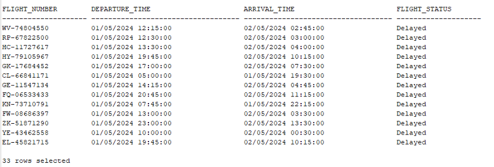

2. **Query 2**: Change the aircraft type for flights operated by a specific airline.

```sql
UPDATE Aircraft a
SET a.AIRCRAFT_TYPE = 'Airbus A320'
WHERE a.AIRCRAFT_ID IN (
    SELECT f.AIRCRAFT_ID
    FROM Flights f
    JOIN Airlines al ON f.AIRLINE_ID = al.AIRLINE_ID
    WHERE al.AIRLINE_NAME = 'Delta Air Lines'
);
```


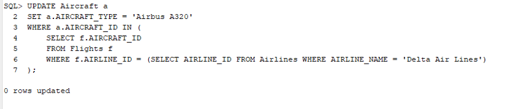


3. **Query 3**: Updates the status of all flights whose Arrival_Time exceeded the current time to Landed

```sql
UPDATE Flights
SET Flight_Status = 'Arrived'
WHERE Arrival_Time < SYSDATE;
```

## Query With Parameters

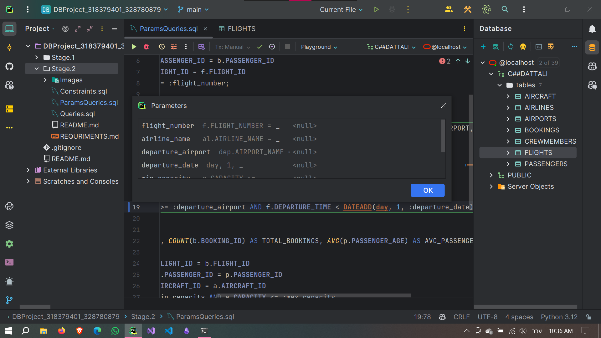

1. **Query 1**: Retrieve passenger details (name, phone, email) for passengers who have a booking on a flight with a given flight number.

```sql
SELECT p.PASSENGER_NAME, p.PASSENGER_PHONE, p.PASSENGER_EMAIL
FROM Passengers p
JOIN Bookings b ON p.PASSENGER_ID = b.PASSENGER_ID
JOIN Flights f ON b.FLIGHT_ID = f.FLIGHT_ID
WHERE f.FLIGHT_NUMBER = :flight_number;
```

2. **Query 2**: Find the flight details (flight number, departure/arrival airports, airline name) for flights operated by a specific airline and departing from a given airport on a specific date.

```sql
SELECT f.FLIGHT_NUMBER,
       dep.AIRPORT_NAME AS DEPARTURE_AIRPORT,
       arr.AIRPORT_NAME AS ARRIVAL_AIRPORT,
       al.AIRLINE_NAME
FROM Flights f
JOIN Airports dep ON f.DEPARTURE_AIRPORT = dep.AIRPORT_ID
JOIN Airports arr ON f.ARRIVAL_AIRPORT = arr.AIRPORT_ID
JOIN Airlines al ON f.AIRLINE_ID = al.AIRLINE_ID
WHERE al.AIRLINE_NAME = :airline_name
  AND dep.AIRPORT_NAME = :departure_airport
  AND f.DEPARTURE_TIME >= :departure_date
  AND f.DEPARTURE_TIME < :departure_date + 1;

```

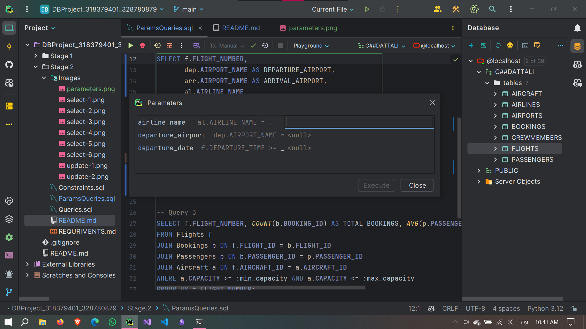

3. **Query 3**: Get the total number of bookings and the average passenger age for flights with a specific aircraft capacity range.

```sql
SELECT f.FLIGHT_NUMBER, 
       COUNT(b.BOOKING_ID) AS TOTAL_BOOKINGS, 
       AVG(EXTRACT(YEAR FROM SYSDATE) - EXTRACT(YEAR FROM p.PASSENGER_BIRTHDATE)) AS AVG_PASSENGER_AGE
FROM Flights f
JOIN Bookings b ON f.FLIGHT_ID = b.FLIGHT_ID
JOIN Passengers p ON b.PASSENGER_ID = p.PASSENGER_ID
JOIN Aircraft a ON f.AIRCRAFT_ID = a.AIRCRAFT_ID
WHERE a.CAPACITY >= :min_capacity AND a.CAPACITY <= :max_capacity
GROUP BY f.FLIGHT_NUMBER

```

4. **Query 4**: Retrieve the crew members' names and roles for flights operated by a specific airline and departing/arriving on a given date range.

```sql
SELECT cm.CREW_NAME, cm.CREW_ROLE
FROM CrewMembers cm
JOIN WorkingCrew wc ON cm.CREW_ID = wc.CREW_ID
JOIN Flights f ON wc.FLIGHT_ID = f.FLIGHT_ID
JOIN Airlines al ON f.AIRLINE_ID = al.AIRLINE_ID
WHERE al.AIRLINE_NAME = :airline_name
  AND f.DEPARTURE_TIME >= :start_date 
  AND f.ARRIVAL_TIME <= :end_date;
```

### Queries with & parameters

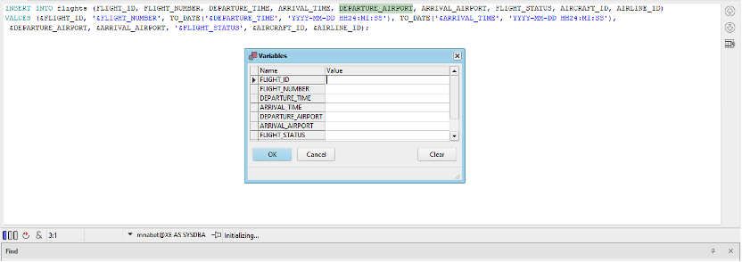
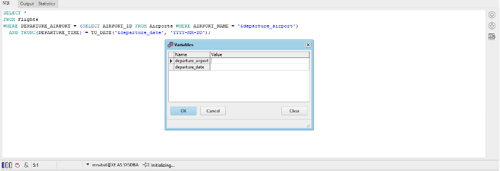

## Constraints

### 1. NOT NULL Constraint

Add a NOT NULL constraint to the CREW_ROLE column in the CrewMembers table to ensure that the crew role is always provided.

```sql
ALTER TABLE CrewMembers
MODIFY (CREW_ROLE VARCHAR2(50) NOT NULL);
```

### 2. CHECK Constraint

Add a CHECK constraint to the Passengers table to ensure that the passenger age is within a valid range (e.g., between 18 and 100).

```sql
ALTER TABLE Passengers
ADD CONSTRAINT CHK_PassengerAge 
CHECK (
    (EXTRACT(YEAR FROM SYSDATE) - EXTRACT(YEAR FROM PASSENGER_BIRTHDATE)) - 
    CASE 
        WHEN TO_CHAR(SYSDATE, 'MMDD') < TO_CHAR(PASSENGER_BIRTHDATE, 'MMDD') THEN 1 
        ELSE 0 
    END 
    BETWEEN 18 AND 100
);
```
### 3. DEFAULT Constraint

Add a DEFAULT constraint to the BOOKING_DATE column in the Bookings table to set the current date as the default value if no value is provided.

```sql
ALTER TABLE Bookings
MODIFY (BOOKING_DATE DEFAULT SYSDATE);
```
