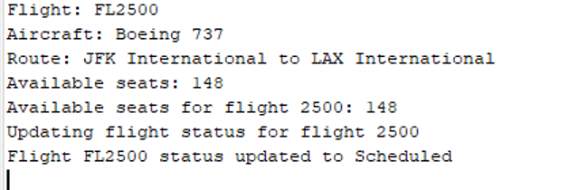
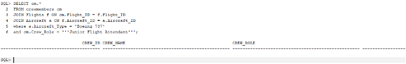
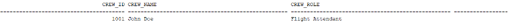
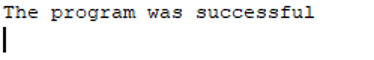

# Stage 3 Report

## Code Requirements

- 2 function
- 2 procedures
- 2 main program

## Function

1. `GET_JUNIOR_FLIGHT_ATTENDANTS_BY_AIRCRAFT_TYPE`
   - Input: `aircraft_type_id INT`
   - Output: `junior_flight_attendants`
   - Description: Returns all junior flight attendants that are qualified to work on an aircraft of a given type.

> **Note:**
> The purpose of this function is:
>
> - To get all junior flight attendants that are qualified to work on an aircraft of a given type.
> - To promote all junior flight attendants that are qualified to work on an aircraft of a given type to senior flight attendants.

```sql
CREATE OR REPLACE FUNCTION GET_JUNIOR_FLIGHT_ATTENDANTS_BY_AIRCRAFT_TYPE(aircraft_type IN VARCHAR2)
RETURN SYS_REFCURSOR IS
    crew_cursor SYS_REFCURSOR;
BEGIN
    OPEN crew_cursor FOR
    SELECT cm.CREW_ID
    FROM CrewMembers cm
    JOIN Flights f ON cm.FLIGHT_ID = f.FLIGHT_ID
    JOIN Aircraft a ON f.AIRCRAFT_ID = a.AIRCRAFT_ID
    WHERE a.AIRCRAFT_TYPE = aircraft_type
    AND cm.CREW_ROLE = 'Junior Flight Attendant';

    RETURN crew_cursor;
END;
```

2. `calculate_available_seats`
   - Input: `flight_id INT`
   - Output: `available_seats`
   - Description: Returns the number of available seats on a given flight.

> **Note:**
> The purpose of this function is:
>
> - To calculate the number of available seats on a given flight.
> - To update the status of a given flight to a new status.

```sql
CREATE OR REPLACE FUNCTION calculate_available_seats(p_flight_id IN NUMBER)
RETURN NUMBER
IS
    v_total_capacity NUMBER;
    v_booked_seats NUMBER;
    v_available_seats NUMBER;

    -- Define a record type for flight details
    TYPE flight_details_rec IS RECORD (
        flight_number VARCHAR2(15),
        aircraft_type VARCHAR2(100),
        departure_airport VARCHAR2(100),
        arrival_airport VARCHAR2(100)
    );
    v_flight_details flight_details_rec;

    -- Define an exception for invalid flight
    invalid_flight EXCEPTION;

BEGIN
    -- Get flight details using cursor
    BEGIN
        SELECT f.flight_number, ac.aircraft_type,
               dep.airport_name, arr.airport_name, ac.capacity
        INTO v_flight_details.flight_number, v_flight_details.aircraft_type,
             v_flight_details.departure_airport, v_flight_details.arrival_airport,
             v_total_capacity
        FROM Flights f
        JOIN Aircraft ac ON f.aircraft_id = ac.aircraft_id
        JOIN Airports dep ON f.departure_airport = dep.airport_id
        JOIN Airports arr ON f.arrival_airport = arr.airport_id
        WHERE f.flight_id = p_flight_id;
    EXCEPTION
        WHEN NO_DATA_FOUND THEN
            RAISE invalid_flight;
    END;

    -- Count booked seats using cursor
    SELECT COUNT(*)
    INTO v_booked_seats
    FROM Bookings
    WHERE flight_id = p_flight_id;

    -- Calculate available seats
    v_available_seats := v_total_capacity - v_booked_seats;

    -- Log flight details and available seats
    DBMS_OUTPUT.PUT_LINE('Flight: ' || v_flight_details.flight_number);
    DBMS_OUTPUT.PUT_LINE('Aircraft: ' || v_flight_details.aircraft_type);
    DBMS_OUTPUT.PUT_LINE('Route: ' || v_flight_details.departure_airport || ' to ' || v_flight_details.arrival_airport);
    DBMS_OUTPUT.PUT_LINE('Available seats: ' || v_available_seats);

    RETURN v_available_seats;

EXCEPTION
    WHEN invalid_flight THEN
        DBMS_OUTPUT.PUT_LINE('Error: Invalid flight ID');
        RETURN NULL;
    WHEN OTHERS THEN
        DBMS_OUTPUT.PUT_LINE('Error: ' || SQLERRM);
        RETURN NULL;
END calculate_available_seats;
```

## Procedures

1. `PROMOTE_JUNIOR_FLIGHT_ATTENDANTS_BY_AIRCRAFT_TYPE`
   - Input: `aircraft_type_id INT`
   - Description: Promotes all junior flight attendants that are qualified to work on an aircraft of a given type to senior flight attendants.

> **Note:**
> The purpose of this procedure is:
>
> - To promote all junior flight attendants that are qualified to work on an aircraft of a given type to senior flight attendants.
> - To update the status of a given flight to a new status.

```sql
CREATE OR REPLACE PROCEDURE PROMOTE_JUNIOR_FLIGHT_ATTENDANTS_BY_AIRCRAFT_TYPE(aircraft_type IN VARCHAR2) IS
    crew_cursor SYS_REFCURSOR;
    v_crew_id NUMBER;
BEGIN
    crew_cursor := GET_JUNIOR_FLIGHT_ATTENDANTS_BY_AIRCRAFT_TYPE(aircraft_type);

    LOOP
        FETCH crew_cursor INTO v_crew_id;
        EXIT WHEN crew_cursor%NOTFOUND;

        UPDATE CrewMembers
        SET CREW_ROLE = 'Flight Attendant'
        WHERE CREW_ID = v_crew_id;
    END LOOP;

    CLOSE crew_cursor;

    COMMIT;
EXCEPTION
    WHEN OTHERS THEN
        ROLLBACK;
        RAISE;
END;
```

2. `update_flight_status`
   - Input: `flight_id INT, new_status VARCHAR`
   - Description: Updates the status of a given flight to a new status.

> **Note:**
> The purpose of this procedure is:
>
> - To update the status of a given flight to a new status.
> - To calculate the number of available seats on a given flight.

```sql
CREATE OR REPLACE PROCEDURE update_flight_status(p_flight_id IN NUMBER)
IS
    v_current_time DATE := TO_DATE('2024-04-30', 'YYYY-MM-DD');
    v_status VARCHAR2(20);
    v_delay_minutes NUMBER;

    -- Cursor for passenger information
    CURSOR c_passengers IS
        SELECT p.passenger_id, p.passenger_name, p.passenger_email
        FROM Bookings b
        JOIN Passengers p ON b.passenger_id = p.passenger_id
        WHERE b.flight_id = p_flight_id;

    -- Record type for flight details
    TYPE flight_details_rec IS RECORD (
        flight_number VARCHAR2(15),
        scheduled_departure DATE,
        scheduled_arrival DATE
    );
    v_flight_details flight_details_rec;

    -- Exception for invalid status update
    invalid_status_update EXCEPTION;
BEGIN
    -- Get flight details
    SELECT flight_number, departure_time, arrival_time
    INTO v_flight_details.flight_number, v_flight_details.scheduled_departure,
         v_flight_details.scheduled_arrival
    FROM Flights
    WHERE flight_id = p_flight_id;

    -- Determine flight status
    IF v_current_time < v_flight_details.scheduled_departure THEN
        v_status := 'Scheduled';
    ELSIF v_current_time BETWEEN v_flight_details.scheduled_departure AND v_flight_details.scheduled_arrival THEN
        v_status := 'In Flight';
    ELSIF v_current_time > v_flight_details.scheduled_arrival THEN
        v_status := 'Arrived';
    ELSE
        RAISE invalid_status_update;
    END IF;

    -- Update flight status
    UPDATE Flights
    SET flight_status = v_status
    WHERE flight_id = p_flight_id;

    COMMIT;
    DBMS_OUTPUT.PUT_LINE('Flight ' || v_flight_details.flight_number || ' status updated to ' || v_status);

EXCEPTION
    WHEN invalid_status_update THEN
        DBMS_OUTPUT.PUT_LINE('Error: Unable to determine flight status');
        ROLLBACK;
    WHEN OTHERS THEN
        DBMS_OUTPUT.PUT_LINE('Error: ' || SQLERRM);
        ROLLBACK;
END update_flight_status;
```

## Main Program

1. `main_program_1`
   - Description: Calls the `GET_JUNIOR_FLIGHT_ATTENDANTS_BY_AIRCRAFT_TYPE` function with a given aircraft type ID and prints the results.

```sql
DECLARE
    v_aircraft_type VARCHAR2(50) := 'Boeing 737';
    crew_cursor SYS_REFCURSOR;
    v_crew_id NUMBER;
BEGIN
    PROMOTE_JUNIOR_FLIGHT_ATTENDANTS_BY_AIRCRAFT_TYPE(v_aircraft_type);

    crew_cursor := GET_JUNIOR_FLIGHT_ATTENDANTS_BY_AIRCRAFT_TYPE(v_aircraft_type);

    FETCH crew_cursor INTO v_crew_id;

    IF crew_cursor%NOTFOUND THEN
        DBMS_OUTPUT.PUT_LINE('The program was successful');
    ELSE
        DBMS_OUTPUT.PUT_LINE('ERROR there are crew member with the role "Junior Flight Attendant".');
    END IF;

    CLOSE crew_cursor;
EXCEPTION
    WHEN OTHERS THEN
        IF crew_cursor%ISOPEN THEN
            CLOSE crew_cursor;
        END IF;
        RAISE;
END;
```

2. `main_program_2`
   - Description: Calls the `calculate_available_seats` function with a given flight ID and prints the results.

```sql
DECLARE
    v_flight_id NUMBER := 2500;  -- Flight ID for FL2500
    v_available_seats NUMBER;
BEGIN
    -- Calculate available seats for the flight
    v_available_seats := calculate_available_seats(v_flight_id);

    IF v_available_seats IS NOT NULL THEN
        DBMS_OUTPUT.PUT_LINE('Available seats for flight ' || v_flight_id || ': ' || v_available_seats);
    ELSE
        DBMS_OUTPUT.PUT_LINE('Could not calculate available seats for flight ' || v_flight_id);
    END IF;

    -- Update flight status
    DBMS_OUTPUT.PUT_LINE('Updating flight status for flight ' || v_flight_id);
    update_flight_status(v_flight_id);
END;
```

# Screen Shots

### Output of the `GET_JUNIOR_FLIGHT_ATTENDANTS_BY_AIRCRAFT_TYPE` function



### Output of the `calculate_available_seats` function


### Output of the `PROMOTE_JUNIOR_FLIGHT_ATTENDANTS_BY_AIRCRAFT_TYPE` procedure






