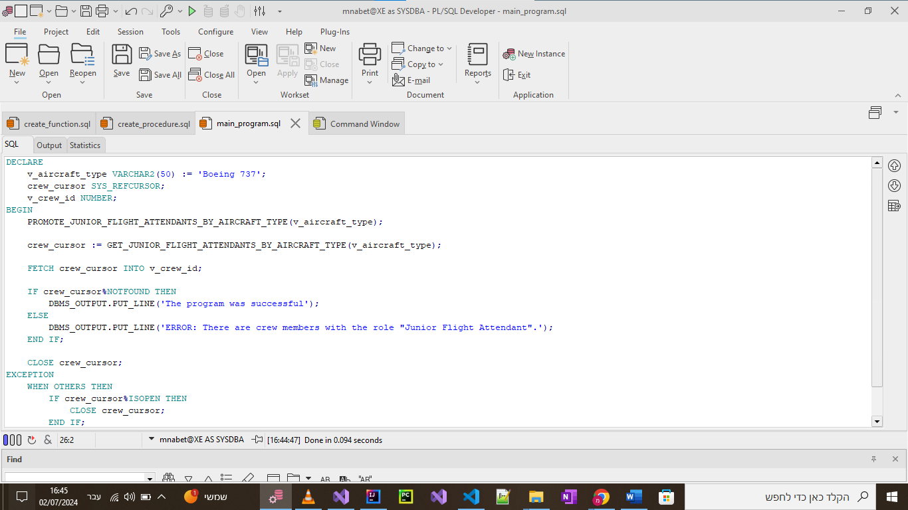
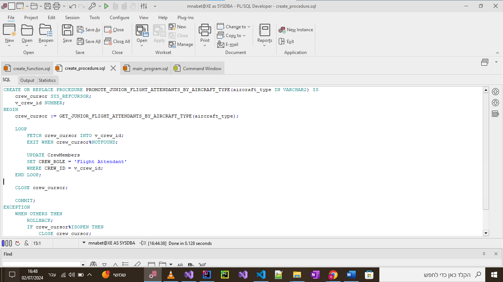
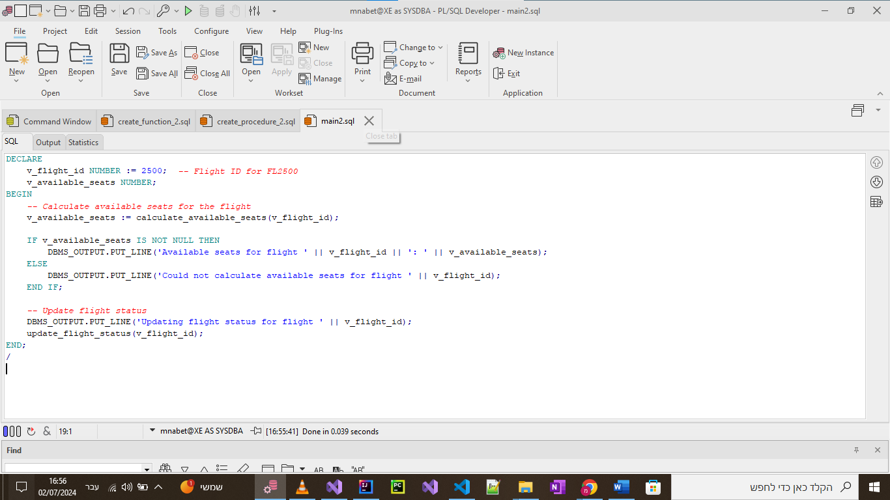
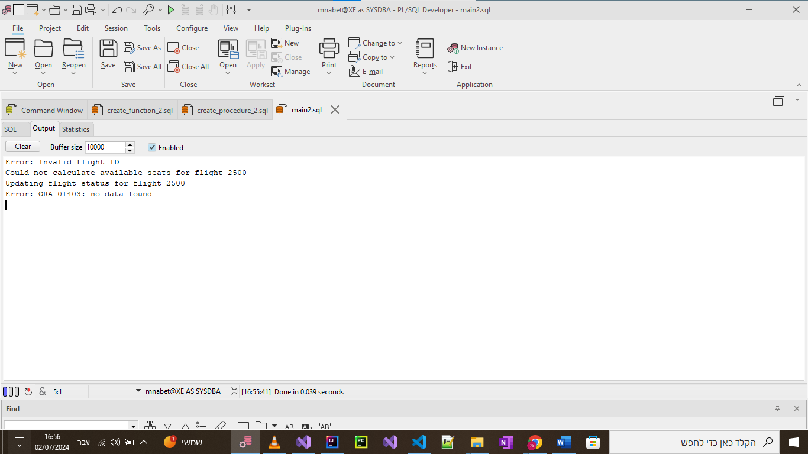
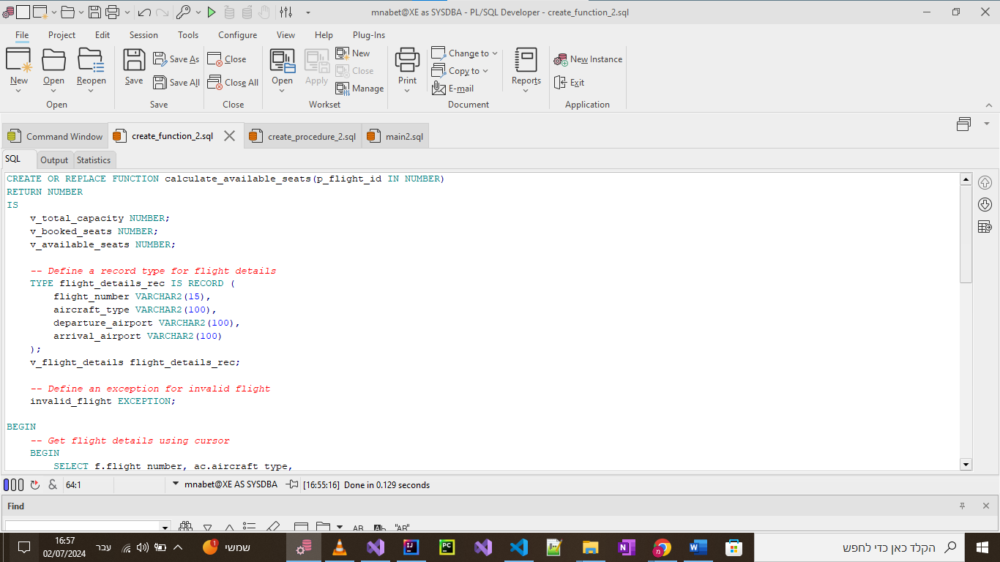
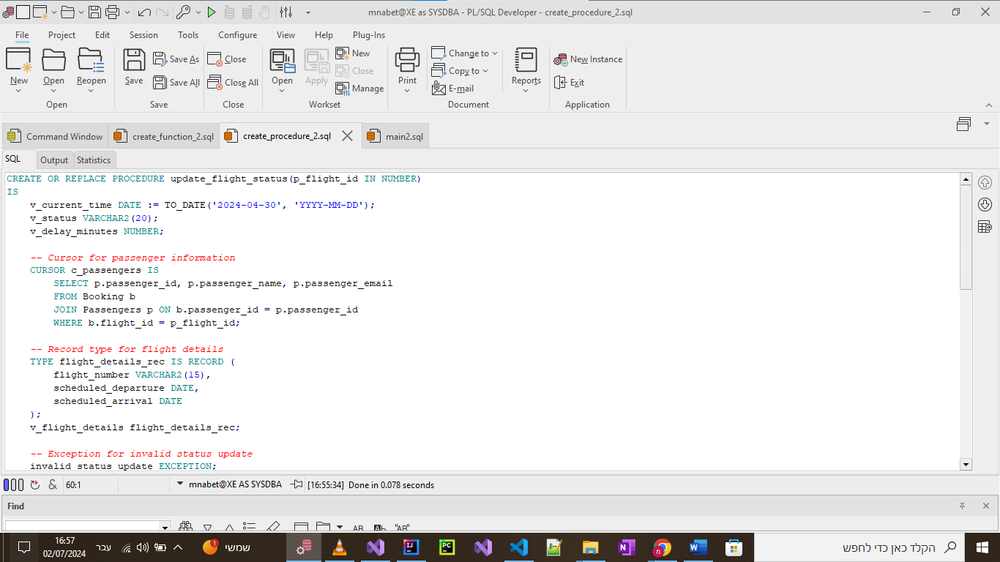

# Stage 3 Report

> [NOTE!] the first part is the function and explaintion in text and the second part is the code and the screenshots output of the code.

## Code Requirements

- 2 function
- 2 procedures
- 2 main program

## Function

### GET_JUNIOR_FLIGHT_ATTENDANTS_BY_AIRCRAFT_TYPE

This function, GET_JUNIOR_FLIGHT_ATTENDANTS_BY_AIRCRAFT_TYPE, is used to retrieve all junior flight attendants qualified to work on a specific type of aircraft. It takes the aircraft type as an input and returns a cursor containing the IDs of the junior flight attendants. This function is useful in scenarios where you need to identify and potentially promote junior flight attendants based on their qualifications for a specific aircraft type. For example, if an airline introduces a new aircraft model and wants to ensure that junior flight attendants qualified for the previous model are also qualified and promoted for the new one, this function can identify the relevant crew members.

1. `GET_JUNIOR_FLIGHT_ATTENDANTS_BY_AIRCRAFT_TYPE`
   - Input: `aircraft_type_id INT`
   - Output: `junior_flight_attendants`
   - Description: Returns all junior flight attendants that are qualified to work on an aircraft of a given type.

> **Note:**
> The purpose of this function is:
>
> - To get all junior flight attendants that are qualified to work on an aircraft of a given type.
> - To promote all junior flight attendants that are qualified to work on an aircraft of a given type to senior flight attendants.

```sql
CREATE OR REPLACE FUNCTION GET_JUNIOR_FLIGHT_ATTENDANTS_BY_AIRCRAFT_TYPE(aircraft_type IN VARCHAR2)
RETURN SYS_REFCURSOR IS
    crew_cursor SYS_REFCURSOR;
BEGIN
    OPEN crew_cursor FOR
    SELECT cm.CREW_ID
    FROM CrewMembers cm
    JOIN WorkingCrew wc ON cm.CREW_ID = wc.CREW_ID
    JOIN Flights f ON wc.FLIGHT_ID = f.FLIGHT_ID
    JOIN Aircraft a ON f.AIRCRAFT_ID = a.AIRCRAFT_ID
    WHERE a.AIRCRAFT_TYPE = aircraft_type
    AND cm.CREW_ROLE = 'Junior Flight Attendant';

    RETURN crew_cursor;
END;
```

### calculate_available_seats

The calculate_available_seats function calculates the number of available seats on a given flight by subtracting the number of booked seats from the total capacity of the aircraft. It takes a flight ID as input and returns the number of available seats. This function is essential for managing flight bookings and ensuring that the flight status is updated based on seat availability. A typical use case is during the booking process, where the system needs to verify seat availability before confirming a booking. For instance, an airline can use this function to check available seats before allowing additional bookings or making decisions about overbooking policies.

2. `calculate_available_seats`
   - Input: `flight_id INT`
   - Output: `available_seats`
   - Description: Returns the number of available seats on a given flight.

> **Note:**
> The purpose of this function is:
>
> - To calculate the number of available seats on a given flight.
> - To update the status of a given flight to a new status.

```sql
CREATE OR REPLACE FUNCTION calculate_available_seats(p_flight_id IN NUMBER)
RETURN NUMBER
IS
    v_total_capacity NUMBER;
    v_booked_seats NUMBER;
    v_available_seats NUMBER;

    -- Define a record type for flight details
    TYPE flight_details_rec IS RECORD (
        flight_number VARCHAR2(15),
        aircraft_type VARCHAR2(100),
        departure_airport VARCHAR2(100),
        arrival_airport VARCHAR2(100)
    );
    v_flight_details flight_details_rec;

    -- Define an exception for invalid flight
    invalid_flight EXCEPTION;

BEGIN
    -- Get flight details using cursor
    BEGIN
        SELECT f.flight_number, ac.aircraft_type,
               dep.airport_name, arr.airport_name, ac.capacity
        INTO v_flight_details.flight_number, v_flight_details.aircraft_type,
             v_flight_details.departure_airport, v_flight_details.arrival_airport,
             v_total_capacity
        FROM Flights f
        JOIN Aircraft ac ON f.aircraft_id = ac.aircraft_id
        JOIN Airports dep ON f.departure_airport = dep.airport_id
        JOIN Airports arr ON f.arrival_airport = arr.airport_id
        WHERE f.flight_id = p_flight_id;
    EXCEPTION
        WHEN NO_DATA_FOUND THEN
            RAISE invalid_flight;
    END;

    -- Count booked seats using cursor
    SELECT COUNT(*)
    INTO v_booked_seats
    FROM Booking
    WHERE flight_id = p_flight_id;

    -- Calculate available seats
    v_available_seats := v_total_capacity - v_booked_seats;

    -- Log flight details and available seats
    DBMS_OUTPUT.PUT_LINE('Flight: ' || v_flight_details.flight_number);
    DBMS_OUTPUT.PUT_LINE('Aircraft: ' || v_flight_details.aircraft_type);
    DBMS_OUTPUT.PUT_LINE('Route: ' || v_flight_details.departure_airport || ' to ' || v_flight_details.arrival_airport);
    DBMS_OUTPUT.PUT_LINE('Available seats: ' || v_available_seats);

    RETURN v_available_seats;

EXCEPTION
    WHEN invalid_flight THEN
        DBMS_OUTPUT.PUT_LINE('Error: Invalid flight ID');
        RETURN NULL;
    WHEN OTHERS THEN
        DBMS_OUTPUT.PUT_LINE('Error: ' || SQLERRM);
        RETURN NULL;
END calculate_available_seats;
```

## Procedures

### PROMOTE_JUNIOR_FLIGHT_ATTENDANTS_BY_AIRCRAFT_TYPE

The procedure PROMOTE_JUNIOR_FLIGHT_ATTENDANTS_BY_AIRCRAFT_TYPE promotes all junior flight attendants qualified to work on a specific type of aircraft to senior flight attendants. It utilizes the function GET_JUNIOR_FLIGHT_ATTENDANTS_BY_AIRCRAFT_TYPE to fetch the IDs of the qualified crew members and then updates their roles in the database. This procedure is particularly useful during organizational changes or crew promotions when there is a need to elevate the roles of qualified junior flight attendants systematically. For example, when an airline decides to promote all junior flight attendants who have completed a certain number of hours or flights on a particular aircraft type, this procedure can automate the promotion process.

1. `PROMOTE_JUNIOR_FLIGHT_ATTENDANTS_BY_AIRCRAFT_TYPE`
   - Input: `aircraft_type_id INT`
   - Description: Promotes all junior flight attendants that are qualified to work on an aircraft of a given type to senior flight attendants.

> **Note:**
> The purpose of this procedure is:
>
> - To promote all junior flight attendants that are qualified to work on an aircraft of a given type to senior flight attendants.
> - To update the status of a given flight to a new status.

```sql
CREATE OR REPLACE PROCEDURE PROMOTE_JUNIOR_FLIGHT_ATTENDANTS_BY_AIRCRAFT_TYPE(aircraft_type IN VARCHAR2) IS
    crew_cursor SYS_REFCURSOR;
    v_crew_id NUMBER;
BEGIN
    crew_cursor := GET_JUNIOR_FLIGHT_ATTENDANTS_BY_AIRCRAFT_TYPE(aircraft_type);

    LOOP
        FETCH crew_cursor INTO v_crew_id;
        EXIT WHEN crew_cursor%NOTFOUND;

        UPDATE CrewMembers
        SET CREW_ROLE = 'Flight Attendant'
        WHERE CREW_ID = v_crew_id;
    END LOOP;

    CLOSE crew_cursor;

    COMMIT;
EXCEPTION
    WHEN OTHERS THEN
        ROLLBACK;
        IF crew_cursor%ISOPEN THEN
            CLOSE crew_cursor;
        END IF;
        RAISE;
END;
```


### update_flight_status

The update_flight_status procedure updates the status of a given flight based on the current time compared to the flight's scheduled departure and arrival times. It determines whether the flight is scheduled, in flight, or arrived, and updates the flight status accordingly. This procedure is crucial for maintaining accurate and up-to-date flight information, which is essential for both operational efficiency and customer communication. A typical scenario is during regular system updates, where the airline's operations control center needs to refresh the status of all flights. For instance, as the current time progresses, this procedure ensures that flight statuses are updated from "Scheduled" to "In Flight" or "Arrived" as appropriate.

2. `update_flight_status`
   - Input: `flight_id INT, new_status VARCHAR`
   - Description: Updates the status of a given flight to a new status.

> **Note:**
> The purpose of this procedure is:
>
> - To update the status of a given flight to a new status.
> - To calculate the number of available seats on a given flight.

```sql
CREATE OR REPLACE PROCEDURE update_flight_status(p_flight_id IN NUMBER)
IS
    v_current_time DATE := TO_DATE('2024-04-30', 'YYYY-MM-DD');
    v_status VARCHAR2(20);
    v_delay_minutes NUMBER;

    -- Cursor for passenger information
    CURSOR c_passengers IS
        SELECT p.passenger_id, p.passenger_name, p.passenger_email
        FROM Booking b
        JOIN Passengers p ON b.passenger_id = p.passenger_id
        WHERE b.flight_id = p_flight_id;

    -- Record type for flight details
    TYPE flight_details_rec IS RECORD (
        flight_number VARCHAR2(15),
        scheduled_departure DATE,
        scheduled_arrival DATE
    );
    v_flight_details flight_details_rec;

    -- Exception for invalid status update
    invalid_status_update EXCEPTION;
BEGIN
    -- Get flight details
    SELECT flight_number, departure_time, arrival_time
    INTO v_flight_details.flight_number, v_flight_details.scheduled_departure, 
         v_flight_details.scheduled_arrival
    FROM Flights
    WHERE flight_id = p_flight_id;

    -- Determine flight status
    IF v_current_time < v_flight_details.scheduled_departure THEN
        v_status := 'Scheduled';
    ELSIF v_current_time BETWEEN v_flight_details.scheduled_departure AND v_flight_details.scheduled_arrival THEN
        v_status := 'In Flight';
    ELSIF v_current_time > v_flight_details.scheduled_arrival THEN
        v_status := 'Arrived';
    ELSE
        RAISE invalid_status_update;
    END IF;

    -- Update flight status
    UPDATE Flights
    SET flight_status = v_status
    WHERE flight_id = p_flight_id;

    COMMIT;
    DBMS_OUTPUT.PUT_LINE('Flight ' || v_flight_details.flight_number || ' status updated to ' || v_status);

EXCEPTION
    WHEN invalid_status_update THEN
        DBMS_OUTPUT.PUT_LINE('Error: Unable to determine flight status');
        ROLLBACK;
    WHEN OTHERS THEN
        DBMS_OUTPUT.PUT_LINE('Error: ' || SQLERRM);
        ROLLBACK;
END update_flight_status;
```

## Main Program

1. `main_program_1`
   - Description: Calls the `GET_JUNIOR_FLIGHT_ATTENDANTS_BY_AIRCRAFT_TYPE` function with a given aircraft type ID and prints the results.

```sql
DECLARE
    v_aircraft_type VARCHAR2(50) := 'Boeing 737'; 
    crew_cursor SYS_REFCURSOR; 
    v_crew_id NUMBER; 
BEGIN
    PROMOTE_JUNIOR_FLIGHT_ATTENDANTS_BY_AIRCRAFT_TYPE(v_aircraft_type);

    crew_cursor := GET_JUNIOR_FLIGHT_ATTENDANTS_BY_AIRCRAFT_TYPE(v_aircraft_type);

    FETCH crew_cursor INTO v_crew_id;

    IF crew_cursor%NOTFOUND THEN
        DBMS_OUTPUT.PUT_LINE('The program was successful');
    ELSE
        DBMS_OUTPUT.PUT_LINE('ERROR: There are crew members with the role "Junior Flight Attendant".');
    END IF;

    CLOSE crew_cursor;
EXCEPTION
    WHEN OTHERS THEN
        IF crew_cursor%ISOPEN THEN
            CLOSE crew_cursor;
        END IF;
        RAISE;
END;
```

2. `main_program_2`
   - Description: Calls the `calculate_available_seats` function with a given flight ID and prints the results.

```sql
DECLARE
    v_flight_id NUMBER := 2500;  -- Flight ID for FL2500
    v_available_seats NUMBER;
BEGIN
    -- Calculate available seats for the flight
    v_available_seats := calculate_available_seats(v_flight_id);

    IF v_available_seats IS NOT NULL THEN
        DBMS_OUTPUT.PUT_LINE('Available seats for flight ' || v_flight_id || ': ' || v_available_seats);
    ELSE
        DBMS_OUTPUT.PUT_LINE('Could not calculate available seats for flight ' || v_flight_id);
    END IF;

    -- Update flight status
    DBMS_OUTPUT.PUT_LINE('Updating flight status for flight ' || v_flight_id);
    update_flight_status(v_flight_id);
END;
```

# Screen Shots

### Output of the `GET_JUNIOR_FLIGHT_ATTENDANTS_BY_AIRCRAFT_TYPE` function


### Output of the `calculate_available_seats` function


### Output of the `PROMOTE_JUNIOR_FLIGHT_ATTENDANTS_BY_AIRCRAFT_TYPE` procedure


### Before run main 1



### run1 result


### FUNCTION1


# PROCEDURE1



### Before run main 1



### run2 result



### FUNCTION2



# PROCEDURE2

