# Stage 4

## Intergration

In this stage we are given the backup file of another team in our organization.
and our tasks it:

1. Extract the backup file.
2. Reverse engineer the backup file to get the DSD Diagram
3. Take the DSD and transform it to an ERD Diagram
4. Alter both database to merge them into one database
5. Create two views (that are not already in the database) that can be used to query the database
6. Create two queries on those views

## Process

### 1. Extraction of the backup file

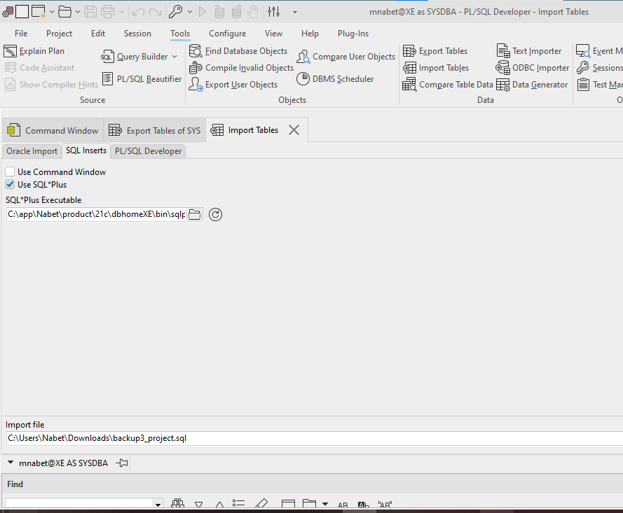

In this part we receive the backup file from the other team in the organization.
and we extracted the file using PL\SQL Developer.

### 2. Reverse engineering the backup file

after looking at the create statement from the backup file we can see the in their database they have the following tables:

```sql
CREATE TABLE TICKET
(
  ticket_id    NUMBER(38) NOT NULL,
  ticket_type  VARCHAR2(255) DEFAULT 'Regular' NOT NULL,
  ticket_price FLOAT NOT NULL
);

CREATE TABLE BAGGAGE
(
  baggage_id     NUMBER(38) NOT NULL,
  baggage_type   VARCHAR2(255) NOT NULL,
  baggage_weight FLOAT NOT NULL,
  ticket_id      NUMBER(38) NOT NULL
);

CREATE TABLE PASSENGER
(
  passenger_id    NUMBER(38) NOT NULL,
  passenger_name  VARCHAR2(255) NOT NULL,
  passenger_phone VARCHAR2(15) NOT NULL,
  passenger_email VARCHAR2(255) NOT NULL
);

CREATE TABLE TICKETSELLER
(
  seller_id      NUMBER(38) NOT NULL,
  seller_name    VARCHAR2(255) NOT NULL,
  seller_contact VARCHAR2(255) NOT NULL
);

CREATE TABLE BOOKING
(
  booking_id   NUMBER(38) DEFAULT '-1' NOT NULL,
  journey_id   NUMBER(38) NOT NULL,
  booking_date DATE NOT NULL,
  passenger_id NUMBER(38) NOT NULL,
  seller_id    NUMBER(38) NOT NULL,
  ticket_id    NUMBER(38) NOT NULL
);

CREATE TABLE PAYMENT_REPORT
(
  payment_id   NUMBER(38) NOT NULL,
  payment_date DATE NOT NULL,
  booking_id   NUMBER(38) NOT NULL
);
```

getting the DSD from the create statement we can see that the DSD is as follows:

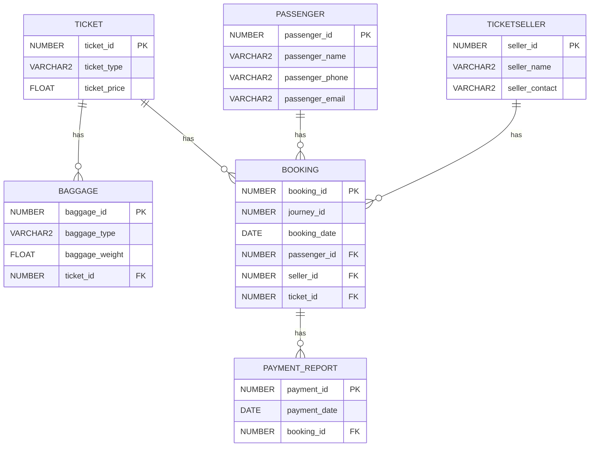

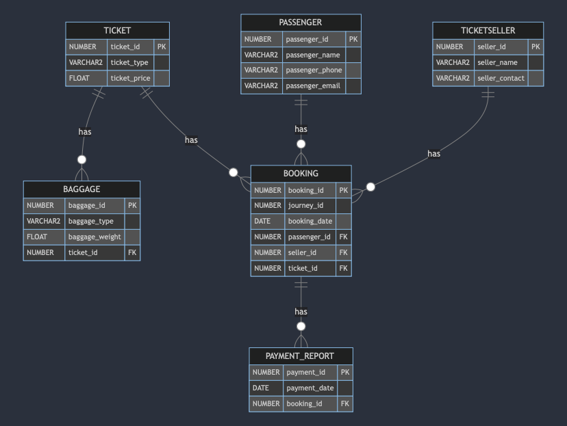
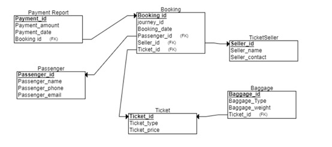


### 3. Transforming the DSD to ERD

Turning the DSD into an ERD we get the following ERD:

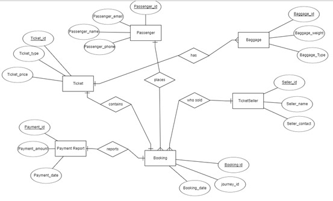


### 4. Altering the database

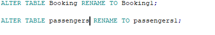

we need to alter our database since in both our database there are a few table with the same name.

joining both databases into one database.

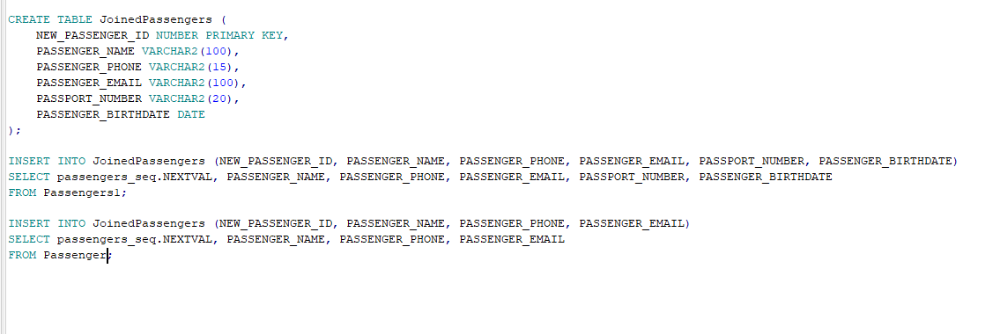
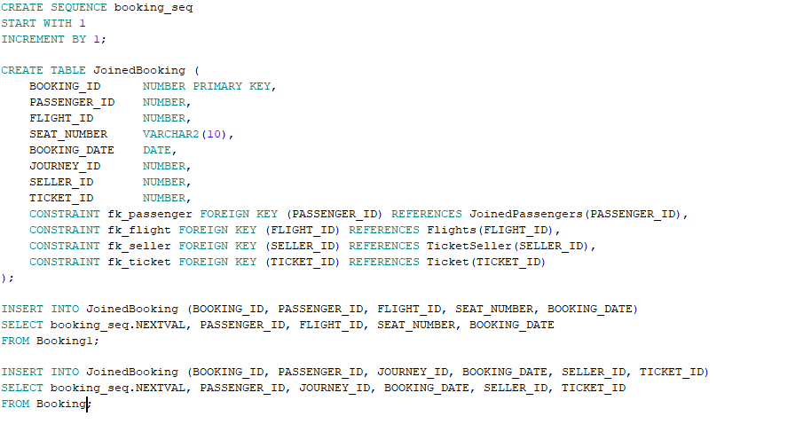

#### Creating a backup file of the new database

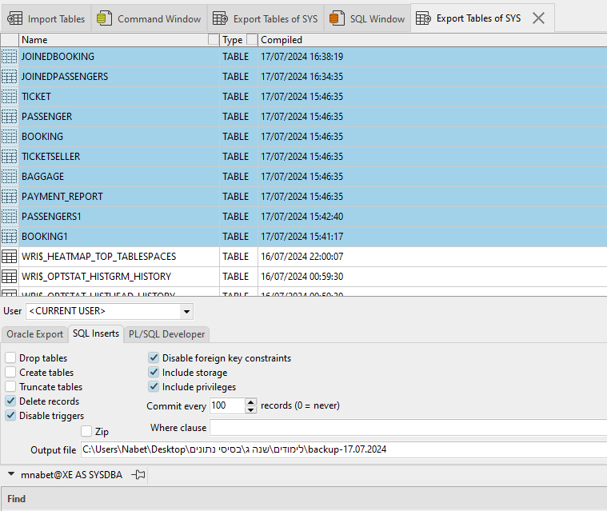

### The new database

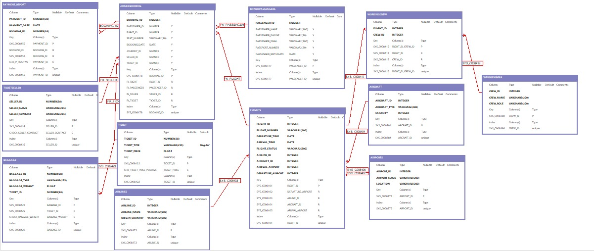

### Create Table Statements

#### JoinedPassengers
```sql
CREATE TABLE JoinedPassengers (
  PASSENGER_ID NUMBER(38) NOT NULL,
  PASSENGER_NAME VARCHAR2(255) NOT NULL,
  PASSENGER_PHONE VARCHAR2(15) NOT NULL,
  PASSENGER_EMAIL VARCHAR2(255) NOT NULL,
  PASSPORT_NUMBER VARCHAR2(20),
  PASSENGER_BIRTHDATE DATE
);
```

#### JoinedBooking
```sql
CREATE TABLE JoinedBooking (
  BOOKING_ID NUMBER(38) NOT NULL,
  PASSENGER_ID NUMBER(38) NOT NULL,
  FLIGHT_ID NUMBER(38) NOT NULL,
  SEAT_NUMBER VARCHAR2(10) NOT NULL,
  BOOKING_DATE DATE NOT NULL,
  JOURNEY_ID NUMBER(38) NOT NULL,
  SELLER_ID NUMBER(38) NOT NULL,
  TICKET_ID NUMBER(38) NOT NULL
);
```

#### Flights
```sql
CREATE TABLE Flights (
  FLIGHT_ID NUMBER(38) NOT NULL,
  FLIGHT_NUMBER VARCHAR2(20) NOT NULL,
  DEPARTURE_TIME DATE NOT NULL,
  ARRIVAL_TIME DATE NOT NULL,
  FLIGHT_STATUS VARCHAR2(20) NOT NULL,
  DEPARTURE_AIRPORT VARCHAR2(100) NOT NULL,
  AIRLINE_ID NUMBER(38) NOT NULL,
  AIRCRAFT_ID NUMBER(38) NOT NULL,
  ARRIVAL_AIRPORT VARCHAR2(100) NOT NULL
);
```

#### Aircraft
```sql
CREATE TABLE Aircraft (
  AIRCRAFT_ID NUMBER(38) NOT NULL,
  AIRCRAFT_TYPE VARCHAR2(50) NOT NULL,
  CAPACITY NUMBER(38) NOT NULL
);
```

#### Airports
```sql
CREATE TABLE Airports (
  AIRPORT_ID NUMBER(38) NOT NULL,
  AIRPORT_NAME VARCHAR2(100) NOT NULL,
  LOCATION VARCHAR2(100) NOT NULL
);
```

#### Airlines
```sql
CREATE TABLE Airlines (
  AIRLINE_ID NUMBER(38) NOT NULL,
  AIRLINE_NAME VARCHAR2(100) NOT NULL,
  ORIGIN_COUNTRY VARCHAR2(50) NOT NULL
);
```

#### CrewMembers
```sql
CREATE TABLE CrewMembers (
  CREW_ID NUMBER(38) NOT NULL,
  CREW_NAME VARCHAR2(100) NOT NULL,
  CREW_ROLE VARCHAR2(50) NOT NULL,
  FLIGHT_ID NUMBER(38) NOT NULL
);
```

#### WorkingCrew
```sql
CREATE TABLE WorkingCrew (
  FLIGHT_ID NUMBER(38) NOT NULL,
  CREW_ID NUMBER(38) NOT NULL
);
```

#### Ticket
```sql
CREATE TABLE Ticket (
  TICKET_ID NUMBER(38) NOT NULL,
  TICKET_TYPE VARCHAR2(255) DEFAULT 'Regular' NOT NULL,
  TICKET_PRICE FLOAT NOT NULL
);
```

#### Baggage
```sql
CREATE TABLE Baggage (
  BAGGAGE_ID NUMBER(38) NOT NULL,
  BAGGAGE_TYPE VARCHAR2(255) NOT NULL,
  BAGGAGE_WEIGHT FLOAT NOT NULL,
  TICKET_ID NUMBER(38) NOT NULL
);
```

#### PaymentReport
```sql
CREATE TABLE PaymentReport (
  PAYMENT_ID NUMBER(38) NOT NULL,
  PAYMENT_AMOUNT NUMBER(38) NOT NULL,
  PAYMENT_DATE DATE NOT NULL,
  BOOKING_ID NUMBER(38) NOT NULL
);
```

#### TicketSeller
```sql
CREATE TABLE TicketSeller (
  SELLER_ID NUMBER(38) NOT NULL,
  SELLER_NAME VARCHAR2(255) NOT NULL,
  SELLER_CONTACT VARCHAR2(255) NOT NULL
);
```


### 5. Creating two views


### View 1

```sql
CREATE VIEW View_OriginalDepartment AS
SELECT 
    b.BOOKING_ID,
    p.PASSENGER_NAME,
    f.FLIGHT_NUMBER,
    pr.PAYMENT_DATE,
    pr.PAYMENT_ID
FROM 
    JOINEDBOOKING b
JOIN 
    JOINEDPASSENGERS p ON b.PASSENGER_ID = p.PASSENGER_ID
JOIN 
    FLIGHTS f ON b.FLIGHT_ID = f.FLIGHT_ID
JOIN 
    PAYMENT_REPORT pr ON b.BOOKING_ID = pr.BOOKING_ID;
```

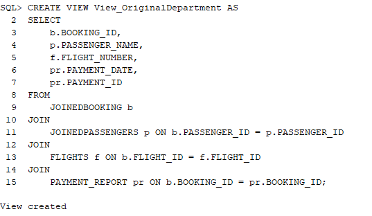

### View 2

```sql
CREATE VIEW View_FlightBooking AS
SELECT 
    f.FLIGHT_NUMBER,
    COUNT(b.BOOKING_ID) AS NumberOfBookings
FROM
    JOINEDBOOKING b
JOIN
    FLIGHTS f ON b.FLIGHT_ID = f.FLIGHT_ID
GROUP BY
    f.FLIGHT_NUMBER;
```

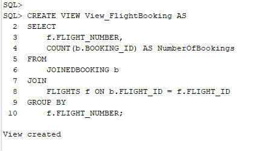

## 6. Querying the views

### Query 1 on view 1

this query is used to get the booking id, passenger name, flight number and payment date from the view.
usage: this query can be used to get the booking id, passenger name, flight number and payment date from the view.

```sql
SELECT BOOKING_ID, PASSENGER_NAME, FLIGHT_NUMBER, PAYMENT_DATE
FROM View_OriginalDepartment;
```

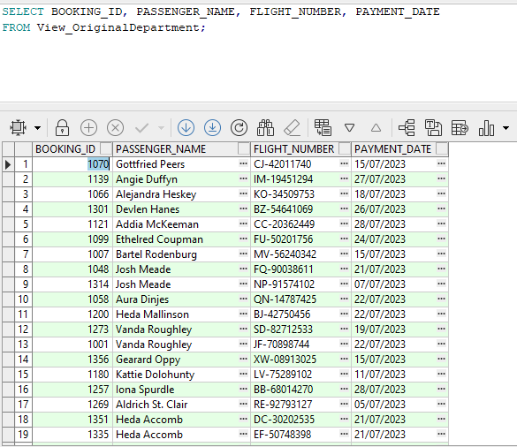


### Query 2 on view 1

this query is used to get the flight number and the number of bookings for that flight.
usage: this query can be used to get the flight number and the number of bookings for that flight.

```sql
SELECT FLIGHT_NUMBER, COUNT(BOOKING_ID) AS NumberOfBookings
FROM View_OriginalDepartment
GROUP BY FLIGHT_NUMBER;
```


### Query 1 on view 2
### return all fthe flights and the number of booking for each flight Sorted in descending order

```sql
SELECT 
    FLIGHT_NUMBER, 
    NumberOfBookings 
FROM 
    View_FlightBooking
ORDER BY 
    NumberOfBookings DESC;

```

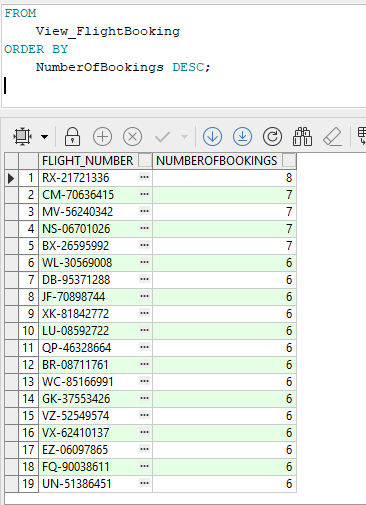


### Query 2 on view 2
### reurn the number of booking for given flight

```sql
SELECT 
    FLIGHT_NUMBER, 
    NumberOfBookings 
FROM 
    View_FlightBooking
WHERE 
    FLIGHT_NUMBER = 'BC-58345061';
```

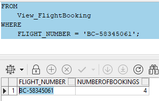

