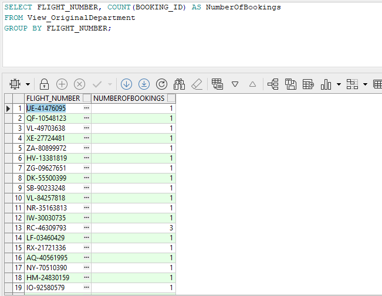

# Stage 4

## Intergration

In this stage we are given the backup file of another team in our organization.
and our tasks it:

1. Extract the backup file.
2. Reverse engineer the backup file to get the DSD Diagram
3. Take the DSD and transform it to an ERD Diagram
4. Alter both database to merge them into one database
5. Create two views (that are not already in the database) that can be used to query the database
6. Create two queries on those views

## Process

### 1. Extraction of the backup file


In this part we receive the backup file from the other team in the organization.
and we extracted the file using PL\SQL Developer.

### 2. Reverse engineering the backup file

after looking at the create statement from the backup file we can see thet in their database they have the following tables:

```sql
CREATE TABLE TICKET
(
  ticket_id    NUMBER(38) PRIMARY KEY,
  ticket_type  VARCHAR2(255) DEFAULT 'Regular' NOT NULL,
  ticket_price FLOAT NOT NULL
);

CREATE TABLE BAGGAGE
(
  baggage_id     NUMBER(38) PRIMARY KEY,
  baggage_type   VARCHAR2(255) NOT NULL,
  baggage_weight FLOAT NOT NULL,
  ticket_id      NUMBER(38) NOT NULL,
  FOREIGN KEY (TICKET_ID) REFERENCES TICKET(TICKET_ID)
);

CREATE TABLE PASSENGER
(
  passenger_id    NUMBER(38) PRIMARY KEY,
  passenger_name  VARCHAR2(255) NOT NULL,
  passenger_phone VARCHAR2(15) NOT NULL,
  passenger_email VARCHAR2(255) NOT NULL
);

CREATE TABLE TICKETSELLER
(
  seller_id      NUMBER(38) PRIMARY KEY,
  seller_name    VARCHAR2(255) NOT NULL,
  seller_contact VARCHAR2(255) NOT NULL
);

CREATE TABLE BOOKING
(
  booking_id   NUMBER(38) DEFAULT '-1' PRIMARY KEY,
  journey_id   NUMBER(38) NOT NULL,
  booking_date DATE NOT NULL,
  passenger_id NUMBER(38) NOT NULL,
  seller_id    NUMBER(38) NOT NULL,
  ticket_id    NUMBER(38) NOT NULL,
  FOREIGN KEY (PASSENGER_ID) REFERENCES PASSENGER(PASSENGER_ID),
    FOREIGN KEY (SELLER_ID) REFERENCES TICKETSELLER(SELLER_ID),
    FOREIGN KEY (TICKET_ID) REFERENCES TICKET(TICKET_ID)
);

CREATE TABLE PAYMENT_REPORT
(
  payment_id   NUMBER(38) PRIMARY KEY,
  payment_date DATE NOT NULL,
  booking_id   NUMBER(38) NOT NULL
);
```

getting the DSD from the create statement we can see that the DSD is as follows:


### 3. Transforming the DSD to ERD

Turning the DSD into an ERD we get the following ERD:


#### Our database before changes


### 4. Altering the database


we need to alter our database since in both our database there are a few table with the same name.

joining both databases into one database.


#### Creating a backup file of the new database


### The new database


### Create Table Statements

```sql
CREATE TABLE Passengers (
  PASSENGER_ID INTEGER PRIMARY KEY ,
  PASSENGER_NAME VARCHAR(255) NOT NULL,
  PASSENGER_PHONE VARCHAR(15) NOT NULL,
  PASSENGER_EMAIL VARCHAR(255) NOT NULL,
  PASSPORT_NUMBER VARCHAR(20),
  PASSENGER_BIRTHDATE DATE
);

CREATE TABLE Booking (
  BOOKING_ID INTEGER PRIMARY KEY,
    PASSENGER_ID INTEGER NOT NULL,
    FLIGHT_ID INTEGER NOT NULL,
    SEAT_NUMBER VARCHAR(10) NOT NULL,
    BOOKING_DATE DATE NOT NULL,
    JOURNEY_ID INTEGER NOT NULL,
    SELLER_ID INTEGER NOT NULL,
    TICKET_ID INTEGER NOT NULL,
    FOREIGN KEY (PASSENGER_ID) REFERENCES Passengers(PASSENGER_ID),
    FOREIGN KEY (FLIGHT_ID) REFERENCES Flights(FLIGHT_ID),
    FOREIGN KEY (SELLER_ID) REFERENCES TicketSellers(SELLER_ID),
    FOREIGN KEY (TICKET_ID) REFERENCES Ticket(TICKET_ID)
);

CREATE TABLE Flights (
  FLIGHT_ID INTEGER PRIMARY KEY,
    FLIGHT_NUMBER VARCHAR(100) NOT NULL,
    DEPARTURE_TIME DATE NOT NULL,
    ARRIVAL_TIME DATE NOT NULL,
    FLIGHT_STATUS VARCHAR(200) NOT NULL,
    AIRLINE_ID INTEGER NOT NULL,
    AIRCRAFT_ID INTEGER NOT NULL,
    DEPARTURE_AIRPORT INTEGER NOT NULL,
    ARRIVAL_AIRPORT INTEGER NOT NULL,
    FOREIGN KEY (AIRLINE_ID) REFERENCES Airlines(AIRLINE_ID),
    FOREIGN KEY (AIRCRAFT_ID) REFERENCES Aircraft(AIRCRAFT_ID),
    FOREIGN KEY (DEPARTURE_AIRPORT) REFERENCES Airports(AIRPORT_ID),
    FOREIGN KEY (ARRIVAL_AIRPORT) REFERENCES Airports(AIRPORT_ID)
);

CREATE TABLE Aircraft (
  AIRCRAFT_ID INTEGER PRIMARY KEY,
  AIRCRAFT_TYPE VARCHAR(200) NOT NULL,
  CAPACITY INTEGER NOT NULL
);

CREATE TABLE Airports (
  AIRPORT_ID INTEGER PRIMARY KEY,
  AIRPORT_NAME VARCHAR(200) NOT NULL,
  LOCATION VARCHAR(200) NOT NULL
);

CREATE TABLE Airlines (
  AIRLINE_ID INTEGER PRIMARY KEY,
  AIRLINE_NAME VARCHAR(200) NOT NULL,
  ORIGIN_COUNTRY VARCHAR(200) NOT NULL
);

CREATE TABLE CrewMembers (
  AIRLINE_ID INTEGER PRIMARY KEY,
  AIRLINE_NAME VARCHAR(200) NOT NULL,
  ORIGIN_COUNTRY VARCHAR(200) NOT NULL
);

CREATE TABLE WorkingCrew (
  FLIGHT_ID INTEGER NOT NULL,
  CREW_ID INTEGER NOT NULL,
  PRIMARY KEY (FLIGHT_ID, CREW_ID),
  FOREIGN KEY (FLIGHT_ID) REFERENCES Flights(FLIGHT_ID),
  FOREIGN KEY (CREW_ID) REFERENCES CrewMembers(CREW_ID)
);

CREATE TABLE Ticket (
  TICKET_ID integer PRIMARY KEY,
  TICKET_TYPE VARCHAR(255) DEFAULT 'Regular' NOT NULL,
  TICKET_PRICE FLOAT NOT NULL
);

CREATE TABLE Baggage (
  BAGGAGE_ID integer PRIMARY KEY,
  BAGGAGE_TYPE VARCHAR(255) NOT NULL,
  BAGGAGE_WEIGHT FLOAT NOT NULL,
  TICKET_ID integer NOT NULL,
  FOREIGN KEY (TICKET_ID) REFERENCES Ticket(TICKET_ID)
);

CREATE TABLE PaymentReport (
  PAYMENT_ID integer PRIMARY KEY,
  PAYMENT_DATE DATE NOT NULL,
  BOOKING_ID integer NOT NULL,
  FOREIGN KEY (BOOKING_ID) REFERENCES Booking(BOOKING_ID)
);

CREATE TABLE TicketSeller (
  SELLER_ID integer PRIMARY KEY,
  SELLER_NAME VARCHAR(255) NOT NULL,
  SELLER_CONTACT VARCHAR(255) NOT NULL
);
```

#### Diagrams

##### ERD


##### DSD


### 5. Creating two views

### View 1

```sql
CREATE VIEW View_OriginalDepartment AS
SELECT 
    b.BOOKING_ID,
    p.PASSENGER_NAME,
    f.FLIGHT_NUMBER,
    pr.PAYMENT_DATE,
    pr.PAYMENT_ID
FROM 
    JOINEDBOOKING b
JOIN 
    JOINEDPASSENGERS p ON b.PASSENGER_ID = p.PASSENGER_ID
JOIN 
    FLIGHTS f ON b.FLIGHT_ID = f.FLIGHT_ID
JOIN 
    PAYMENT_REPORT pr ON b.BOOKING_ID = pr.BOOKING_ID;
```


### View 2

```sql
CREATE VIEW View_FlightBooking AS
SELECT 
    f.FLIGHT_NUMBER,
    COUNT(b.BOOKING_ID) AS NumberOfBookings
FROM
    JOINEDBOOKING b
JOIN
    FLIGHTS f ON b.FLIGHT_ID = f.FLIGHT_ID
GROUP BY
    f.FLIGHT_NUMBER;
```


## 6. Querying the views

### Query 1 on view 1

this query is used to get the booking id, passenger name, flight number and payment date from the view.
usage: this query can be used to get the booking id, passenger name, flight number and payment date from the view.

```sql
SELECT BOOKING_ID, PASSENGER_NAME, FLIGHT_NUMBER, PAYMENT_DATE
FROM View_OriginalDepartment;
```


### Query 2 on view 1

this query is used to get the flight number and the number of bookings for that flight.
usage: this query can be used to get the flight number and the number of bookings for that flight.

```sql
SELECT FLIGHT_NUMBER, COUNT(BOOKING_ID) AS NumberOfBookings
FROM View_OriginalDepartment
GROUP BY FLIGHT_NUMBER;
```



### Query 1 on view 2
### return all fthe flights and the number of booking for each flight Sorted in descending order

```sql
SELECT 
    FLIGHT_NUMBER, 
    NumberOfBookings 
FROM 
    View_FlightBooking
ORDER BY 
    NumberOfBookings DESC;

```


### Query 2 on view 2
### reurn the number of booking for given flight

```sql
SELECT 
    FLIGHT_NUMBER, 
    NumberOfBookings 
FROM 
    View_FlightBooking
WHERE 
    FLIGHT_NUMBER = 'BC-58345061';
```


### שינוי הפונקציות והפרוצדורות והקבצים הרשאים משלב 3 שיעבדו על בסיס הנתונים המשותף

### פונקציה 1

```sql
CREATE OR REPLACE FUNCTION GET_JUNIOR_FLIGHT_ATTENDANTS_BY_AIRCRAFT_TYPE(aircraft_type IN VARCHAR2)
RETURN SYS_REFCURSOR IS
    crew_cursor SYS_REFCURSOR;
BEGIN
    OPEN crew_cursor FOR
    SELECT cm.CREW_ID
    FROM CrewMembers cm
    JOIN WorkingCrew wc ON cm.CREW_ID = wc.CREW_ID
    JOIN Flights f ON wc.FLIGHT_ID = f.FLIGHT_ID
    JOIN Aircraft a ON f.AIRCRAFT_ID = a.AIRCRAFT_ID
    WHERE a.AIRCRAFT_TYPE = aircraft_type
    AND cm.CREW_ROLE = 'Junior Flight Attendant';

    RETURN crew_cursor;
END;
```

### פונקציה 2

```sql
CREATE OR REPLACE FUNCTION CALCULATE_AVAILABLE_SEATS(p_flight_id IN NUMBER)
RETURN NUMBER
IS
    v_total_capacity NUMBER;
    v_booked_seats NUMBER;
    v_available_seats NUMBER;

    -- Define a record type for flight details
    TYPE flight_details_rec IS RECORD (
        flight_number VARCHAR2(15),
        aircraft_type VARCHAR2(100),
        departure_airport VARCHAR2(100),
        arrival_airport VARCHAR2(100)
    );
    v_flight_details flight_details_rec;

    -- Define an exception for invalid flight
    invalid_flight EXCEPTION;

BEGIN
    -- Get flight details using cursor
    BEGIN
        SELECT f.flight_number, ac.aircraft_type,
               dep.airport_name, arr.airport_name, ac.capacity
        INTO v_flight_details.flight_number, v_flight_details.aircraft_type,
             v_flight_details.departure_airport, v_flight_details.arrival_airport,
             v_total_capacity
        FROM Flights f
        JOIN Aircraft ac ON f.aircraft_id = ac.aircraft_id
        JOIN Airports dep ON f.departure_airport = dep.airport_id
        JOIN Airports arr ON f.arrival_airport = arr.airport_id
        WHERE f.flight_id = p_flight_id;
    EXCEPTION
        WHEN NO_DATA_FOUND THEN
            RAISE invalid_flight;
    END;

    -- Count booked seats using cursor
    SELECT COUNT(*)
    INTO v_booked_seats
    FROM joinedbooking
    WHERE flight_id = p_flight_id;

    -- Calculate available seats
    v_available_seats := v_total_capacity - v_booked_seats;

    -- Log flight details and available seats
    DBMS_OUTPUT.PUT_LINE('Flight: ' || v_flight_details.flight_number);
    DBMS_OUTPUT.PUT_LINE('Aircraft: ' || v_flight_details.aircraft_type);
    DBMS_OUTPUT.PUT_LINE('Route: ' || v_flight_details.departure_airport || ' to ' || v_flight_details.arrival_airport);
    DBMS_OUTPUT.PUT_LINE('Available seats: ' || v_available_seats);

    RETURN v_available_seats;

EXCEPTION
    WHEN invalid_flight THEN
        DBMS_OUTPUT.PUT_LINE('Error: Invalid flight ID');
        RETURN NULL;
    WHEN OTHERS THEN
        DBMS_OUTPUT.PUT_LINE('Error: ' || SQLERRM);
        RETURN NULL;
END CALCULATE_AVAILABLE_SEATS;
/
```

### פרוצדורה 1

```sql
CREATE OR REPLACE PROCEDURE PROMOTE_JUNIOR_FLIGHT_ATTENDANTS_BY_AIRCRAFT_TYPE(aircraft_type IN VARCHAR2) IS
    crew_cursor SYS_REFCURSOR;
    v_crew_id NUMBER;
BEGIN
    crew_cursor := GET_JUNIOR_FLIGHT_ATTENDANTS_BY_AIRCRAFT_TYPE(aircraft_type);

    LOOP
        FETCH crew_cursor INTO v_crew_id;
        EXIT WHEN crew_cursor%NOTFOUND;

        UPDATE CrewMembers
        SET CREW_ROLE = 'Flight Attendant'
        WHERE CREW_ID = v_crew_id;
    END LOOP;

    CLOSE crew_cursor;

    COMMIT;
EXCEPTION
    WHEN OTHERS THEN
        ROLLBACK;
        IF crew_cursor%ISOPEN THEN
            CLOSE crew_cursor;
        END IF;
        RAISE;
END;
```

### פרוצדורה 2

```sql
CREATE OR REPLACE PROCEDURE UPDATE_FLIGHT_STATUS(p_flight_id IN NUMBER)
IS
    v_current_time DATE := SYSDATE;
    v_status VARCHAR2(20);

    -- Record type for flight details
    TYPE flight_details_rec IS RECORD (
        flight_number VARCHAR2(15),
        scheduled_departure DATE,
        scheduled_arrival DATE
    );
    v_flight_details flight_details_rec;

    -- Exception for invalid status update
    invalid_status_update EXCEPTION;
BEGIN
    -- Get flight details
    SELECT flight_number, departure_time, arrival_time
    INTO v_flight_details.flight_number, v_flight_details.scheduled_departure, 
         v_flight_details.scheduled_arrival
    FROM Flights
    WHERE flight_id = p_flight_id;

    -- Determine flight status
    IF v_current_time < v_flight_details.scheduled_departure THEN
        v_status := 'Scheduled';
    ELSIF v_current_time BETWEEN v_flight_details.scheduled_departure AND v_flight_details.scheduled_arrival THEN
        v_status := 'In Flight';
    ELSIF v_current_time > v_flight_details.scheduled_arrival THEN
        v_status := 'Arrived';
    ELSE
        RAISE invalid_status_update;
    END IF;

    -- Update flight status
    UPDATE Flights
    SET flight_status = v_status
    WHERE flight_id = p_flight_id;

    COMMIT;
    DBMS_OUTPUT.PUT_LINE('Flight ' || v_flight_details.flight_number || ' status updated to ' || v_status);

EXCEPTION
    WHEN invalid_status_update THEN
        DBMS_OUTPUT.PUT_LINE('Error: Unable to determine flight status');
        ROLLBACK;
    WHEN OTHERS THEN
        DBMS_OUTPUT.PUT_LINE('Error: ' || SQLERRM);
        ROLLBACK;
END UPDATE_FLIGHT_STATUS;
```

### main 1

```sql
DECLARE
    v_aircraft_type VARCHAR2(50) := 'Boeing 737'; 
    crew_cursor SYS_REFCURSOR; 
    v_crew_id NUMBER; 
BEGIN
    PROMOTE_JUNIOR_FLIGHT_ATTENDANTS_BY_AIRCRAFT_TYPE(v_aircraft_type);

    crew_cursor := GET_JUNIOR_FLIGHT_ATTENDANTS_BY_AIRCRAFT_TYPE(v_aircraft_type);

    FETCH crew_cursor INTO v_crew_id;

    IF crew_cursor%NOTFOUND THEN
        DBMS_OUTPUT.PUT_LINE('The program was successful');
    ELSE
        DBMS_OUTPUT.PUT_LINE('ERROR: There are crew members with the role "Junior Flight Attendant".');
    END IF;

    CLOSE crew_cursor;
EXCEPTION
    WHEN OTHERS THEN
        IF crew_cursor%ISOPEN THEN
            CLOSE crew_cursor;
        END IF;
        RAISE;
END;
```

### main 2

```sql
DECLARE
    v_flight_id NUMBER := 2500;  -- Flight ID for FL2500
    v_available_seats NUMBER;
BEGIN
    -- Calculate available seats for the flight
    v_available_seats := CALCULATE_AVAILABLE_SEATS(v_flight_id);

    IF v_available_seats IS NOT NULL THEN
        DBMS_OUTPUT.PUT_LINE('Available seats for flight ' || v_flight_id || ': ' || v_available_seats);
    ELSE
        DBMS_OUTPUT.PUT_LINE('Could not calculate available seats for flight ' || v_flight_id);
    END IF;

    -- Update flight status
    DBMS_OUTPUT.PUT_LINE('Updating flight status for flight ' || v_flight_id);
    UPDATE_FLIGHT_STATUS(v_flight_id);
END;
/
```

#### בפונקציה השניה השתמשנו בטבלה booking לאחר שמיזגנו את בסיס הנתונים צריך להשתמש בטבלה joinedbooking